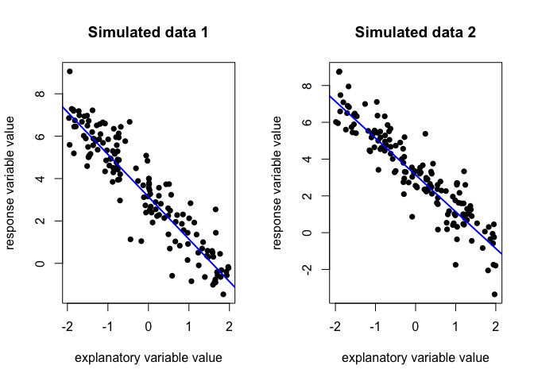
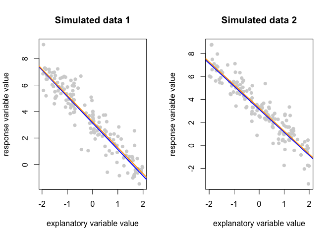
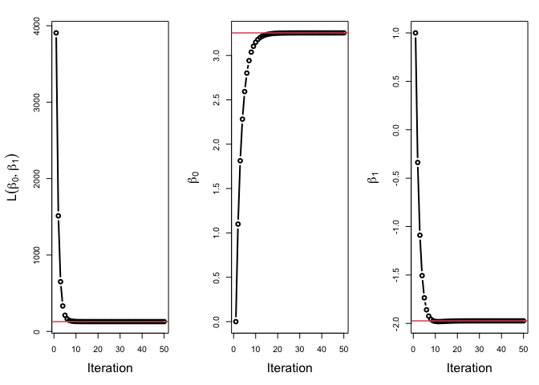
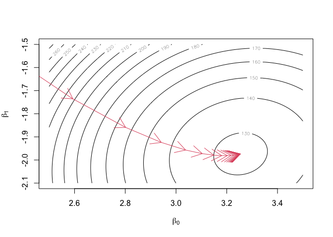
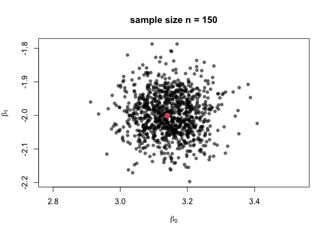
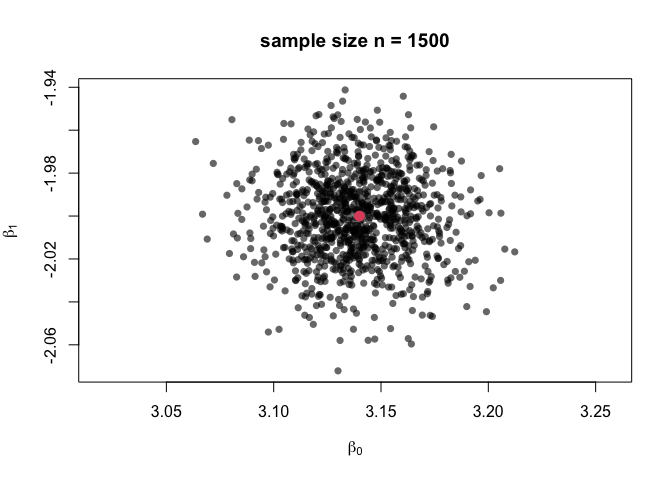
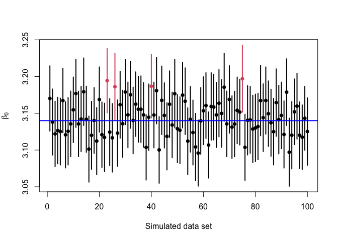

# Simple linear regression

In this lab we will focus on one of the most widely used supervised learning models, linear regression. In particular, we initially restrict attention to _simple_ linear regression, in which we are trying to predict a response variable $y$ based on a single explanatory variable $x$, by assuming that they are linked by a linear relationship $y = b_0 + b_1 x$. 

We do not expect this relationship to hold exactly for any particular predictor-response pair, and so each observation is considered to have the form: 
\begin{equation}
  y_i = b_0 + b_1 x_i + \epsilon_i, \quad \text{for } i = 1,\ldots,n.
  (\#eq:simpleLinearRegression)
\end{equation}

***

__Task 1.1:__ Name and interpret each term in equation \@ref(eq:simpleLinearRegression). 

__Solution 1.1:__

<details><summary>Show answer</summary>

 - $y_i$ is the response variable value for the $i^{\text{th}}$ observation,. Taken as a whole, $y$ is often referred to as the target variable in a machine learning context. 

 - $x_i$ is the explanatory variable value for the $i^\text{th}$ observation. This is often referred to as a feature or predictor variable in machine learning contexts or as a covariate in statistical contexts (because it varies along with the quantity we are trying to model). 

 - $b_0$ is the expected value of the response variable $y$ when the explanatory variable $x$ is equal to zero. It is known as the intercept of the linear model in machine learning contexts and the bias in machine learning contexts. (note: this can cause confusion, since the term bias also has a different statistical definition).

 - $b_1$ is the expected increase in the response variable $y$ per unit increase in the explanatory variable $x$. This is known as the gradient or slope. 

- $\epsilon_i$ is the error of observation $i$. This is difference between the observed value of $y_i$ and the value we would predict if the coefficients $b_0$ and $b_1$ were known. This represents additional variation in $y_i$ that is not described by the predictor variable, for example from an unmeasured predictor or limitations in the measurement process. 
</details>

***

__Task 1.2:__ Simulate two data sets from the above model, each with $n = 150$ observed predictor-response pairs. In your simulation: 

- Assume that the error terms are independent and normally distributed with mean 0 and variance $\sigma^2$;
- Assume that the explanatory variables are independent and follow a continuous uniform distribution on the interval [-2,2];
- Use $b_0 = 3.14$, $b_1 = -2$ and $\sigma^2 = 0.8$. 

For each data set, plot the simulated data and the overlay the true relationship between $y$ and $x$. 

__Solution 1.2:__

<details><summary>Show answer</summary>


```r
# Set constants
n <- 150
b_0 <- 3.14 
b_1 <- -2
sigma_sq <- 0.8

x_min <- -2
x_max <- 2

# Simulate explanatory variable and error values
set.seed(1234)
x_1 <- runif(n, min = x_min, max = x_max)
x_2 <- runif(n, min = x_min, max = x_max)
e_1 <- rnorm(n, mean = 0, sd = sqrt(sigma_sq)) 
e_2 <- rnorm(n, mean = 0, sd = sqrt(sigma_sq))

# Calculate response variable values
y_1 <- b_0 + b_1 * x_1 + e_1
y_2 <- b_0 + b_1 * x_2 + e_1

# Plot both fitted models and data sets
par(mfrow = c(1,2))
plot(
  x = x_1,
  y = y_1,
  pch = 16,
  xlab = "explanatory variable value",
  ylab = "response variable value",
  main = "Simulated data 1")
abline(a = b_0, b = b_1, col = "blue", lwd = 2)

plot(
  x = x_2,
  y = y_2,
  pch = 16,
  xlab = "explanatory variable value",
  ylab = "response variable value",
  main = "Simulated data 2")
abline(a = b_0, b = b_1, col = "blue", lwd = 2)
```

<div class="figure" style="text-align: center">

<p class="caption">(\#fig:task-12)Two simulated data sets with a noisy linear relationship between explanatory and response variables.</p>
</div>

```r
par(mfrow = c(1,1))
```
</details>

***

__Task 1.3:__ Investigate how changing the values of $b_0$, $b_1$ and $\sigma^2$ alter these plots. How does this correspond to your answer in Task 1.1? 

__Solution 1.3:__ 
<details><summary>Show answer</summary>
By re-running the previous code, altering the values of $b_0$, $b_1$ and $\sigma^2$ we find that:

  - $b_0$ controls the expected level of $y$ when $x = 0$. 
  - $b_1$ controls the magnitude and direction of the relationship between $x$ and $y$.
  - $\sigma^2$ controls  the level of noise in the simulated data about the true relationship, where larger values correspond to greater variablility. 
</details>

***

__Task 1.4:__ Use the `lm()` function to estimate the linear relationship between $y$ and $x$ using one of your simulated data sets. Create a plot of the simulated data, fitted and true relationship. You may find the documentation for `lm()` useful, open this by running `help(lm)`. Repeat with the other data set. 

__Solution 1.4:__
<details><summary>Show answer</summary>

```r
# Fit a linear model to each simulated data set
lm_1 <- lm(y_1 ~ x_1)
lm_2 <- lm(y_2 ~ x_2)

# Examine the fitted model parameters
coefficients(lm_1)
## (Intercept)         x_1 
##    3.254496   -1.973355
coefficients(lm_2)
## (Intercept)         x_2 
##    3.251143   -2.006149

# Plot both data sets
par(mfrow = c(1,2))
plot(
  x = x_1,
  y = y_1,
  pch = 16,
  xlab = "explanatory variable value",
  ylab = "response variable value",
  main = "Simulated data 1",
  col = "lightgrey")
abline(a = b_0, b = b_1, lwd = 2, col = "blue")
abline(lm_1, col = "orange", lwd = 2)

plot(
  x = x_2,
  y = y_2,
  pch = 16,
  xlab = "explanatory variable value",
  ylab = "response variable value",
  main = "Simulated data 2",
  col = "lightgrey")
abline(a = b_0, b = b_1, lwd = 2, col = "blue")
abline(lm_2, col = "orange", lwd = 2)
```

<div class="figure" style="text-align: center">

<p class="caption">(\#fig:solution-14)True (blue) and fitted (orange) linear relationships between explanatory and response variables for for two simulated data sets.</p>
</div>

```r
par(mfrow = c(1,1))
```
</details>

***

# Verifying `lm()` output analytically

The function `lm()` finds the straight line $y = \beta_0 + \beta_1 x$ which minimizes a particular _loss function_. This loss function $L(\beta_0, \beta_1)$ gives a measure of how well (or more accurately, how poorly) a particular line represents our observed data. The values of $\beta_0$ and $\beta_1$ which minimize this loss function are denoted by
$$ \hat \beta = (\hat \beta_0, \hat \beta_1) = \underset{\beta_0, \beta_1}{\arg\min} \ L(\beta_0, \beta_1)$$

and are known as the _regression- or model-coefficients_. The regression coefficients define our regression line and give point estimates for $b_0$ and $b_1$ respectively. 

The linear model obtained using the `lm()` function minimises the _least squares_ loss function: 

\begin{equation}
L(\beta_0, \beta_1) = \sum_{i=1}^n (y_i - \beta_0 - \beta_1 x_i)^2.
(\#eq:least-squares-loss-function)
\end{equation}

Unlike more flexible supervised learning models, for linear regression the model coefficients that minimise the loss function \@ref(eq:least-squares-loss-function) can be calculated exactly and directly through the use of calculus. 

***

__Task 2.1:__ By using partial differentiation and solving a system of simultaneous equations, obtain a closed form for the regression coefficients $\hat \beta_0$ and $\hat \beta_1$ in terms of the observed $x$ and $y$ values. You should confirm that these correspond to a local minimum of the squared error loss function and are equal to the values returned by `lm()`. 

__Solution 2.1:__
<details><summary>Show answer</summary>
We wish to find the values $\hat \beta_0$ and $\hat \beta_1$ that minimise the squared error loss function $L(\beta_0, \beta_1)$. To do this, we find the first-order partial derivatives of $L$ with respect to each coefficient: 

$$
\frac{\partial{L}}{\partial{\beta_0}} = -2 \sum_{i=1}^{n} (y_i - \beta_0 - \beta_1 x_i) \quad \text{and} \quad \frac{\partial{L}}{\partial{\beta_0}} = -2 \sum_{i=1}^{n} x_i(y_i - \beta_0 - \beta_1 x_i).
$$

Any stationary points of the loss function $\hat \beta = (\hat \beta_1, \hat \beta_2)$ must simultaneously satisfy:

$$ \left.\frac{\partial{L}}{\partial{\beta_0}}\right|_{\beta = \hat \beta} = 
-2 \sum_{i=1}^{n} (y_i - \hat\beta_0 - \hat\beta_1 x_i) = 0 $$
and 
$$ 
\left.\frac{\partial{L}}{\partial{\beta_1}}\right|_{\beta = \hat \beta} = 
-2 \sum_{i=1}^{n} x_i(y_i - \hat\beta_0 - \hat\beta_1 x_i) = 0.
$$

Rearranging the first expression for $\hat \beta_0$ and substituting into the second expression we can show that 

$$ 
 \hat \beta_1 = \frac{n \sum x_i y_i - \sum x_i \sum y_i }{n\sum(x_i^2) - \left(\sum x_i\right)^2},
$$
where each sum is taken over values of $i = 1,\ldots,n$. By rearrangement of the partial derivative with respect to $\beta_1$, we then find that

$$
 \hat \beta_0 = \frac{1}{n}\left( \sum_{i=1}^{n} y_i - \hat\beta_1 \sum_{i=1}^{n} x_i\right) = \bar y - \hat\beta_1 \bar x. 
$$

We have therefore identified a unique stationary point for the loss function. 

We can confirm that this matches the `lm()` output by calculating these parameter estimates for our two simulated data sets.


```r
# Function to calculate parameters estimates exactly
get_algebraic_least_squares_estimator <- function(x,y){
  n <- length(x)
  beta_1_hat <- ( n * sum(x * y) - sum(x) * sum(y) ) / ( n * sum(x^2) - sum(x)^2 )
  beta_0_hat <- mean(y) - beta_1_hat * mean(x)
  
  return(c(beta_0_hat, beta_1_hat))
}

# Check lm against algebra for data set 1
get_algebraic_least_squares_estimator(x_1, y_1)
## [1]  3.254496 -1.973355
coefficients(lm_1)
## (Intercept)         x_1 
##    3.254496   -1.973355

# Check lm against algebra for data set 2
get_algebraic_least_squares_estimator(x_2, y_2)
## [1]  3.251143 -2.006149
coefficients(lm_2)
## (Intercept)         x_2 
##    3.251143   -2.006149
```


We can show that this stationary point is a minimum (rather than a maximum or saddle point), by demonstrating that the second partial derivative with respect to $\beta_0$ and determinant of the Hessian matrix are both postive at the stationary point. 

\begin{align*}
\det \mathbf{H}_L(\hat \beta) 
  &= 
  \left | 
    \begin{array}{cc}
      \frac{\partial^2 L}{d\beta_0^2} & \frac{\partial^2 L}{\partial\beta_0\partial\beta_1} \\
      \frac{\partial^2 L}{\partial\beta_1\partial\beta_0} & \frac{\partial^2 L}{d\beta_1^2}
    \end{array}
  \right|_{\beta = \hat\beta} \\[1.5em]
  &=
  \left| 
    \begin{array}{cc}
      2n & 2n \bar x \\[1.5em]
      2 n \bar x & 2 \sum_{i=1}^{n} x_i^2
    \end{array}
  \right | \\[1.5em]
  &= 4n \sum_{i=1}^{n} x_i^2 - 4 \left(\sum_{i=1}^{n} x_i\right)^2 \\[1.5em]
  & = 4n \sum_{i=1}^{n} (x_i - \bar x)^2.
\end{align*}

From this it is evident that for any data set $\frac{\partial^2 L}{d\beta_0^2} = 2n > 0$ and, if not all $x$ values are equal, we also have that $\det \mathbf{H}_L(\hat \beta) > 0$. Therefore, by the the second partial derivative test, the stationary point we have identified is the global minimiser of the squared-error loss function.  
</details>

***

# Verifying `lm()` output using numerical methods 

## Introducing gradient descent
In more complicated supervised learning models, it will not always be possible to analytically minimise the loss function. For these models numerical optimisation routines will be required. Here we introduce one such technique, __gradient descent__. While gradient descent is not required to fit a linear regression model, we develop the idea here to build our intuition and to confirm that the method converges to the analytic solution.

We previously fit a linear regression model by minimising the loss function analytically. This was achieved by determining the point at which the gradient of the loss function $\nabla L = \left (\frac{\partial{L}}{\partial{\beta_0}}, \frac{\partial{L}}{\partial{\beta_1}} \right) = (0,0)$. 

The gradient of the loss function is the direction in $(\beta_0, \beta_1)$ space in which $L$ is increasing most rapidly. One numerical approach to finding a minimum of $L$ is therefore to repeatedly take steps of a small constant size $h$ in the opposite direction. Starting at an arbitrary set of coefficients, we repeatedly step make a small move in the direction that most rapidly decreases $L$ with the aim of reaching a local (and hopefully a global) minimum: 

$$ \beta_\text{new} = \beta_{\text{current}} - h \nabla L.$$

## Implementing gradient descent

__Task 3.1:__ Implement gradient descent to obtain regression coefficients $\hat \beta$ using your simulated data. Make sure to record the coefficient values at the loss function value at each iteration. 

__Solution 3.1:__
<details><summary>Show answer</summary>

```r
gradient_descent <- function(func, grad, init, h, n_steps = 50, ...){
  
  out <- as.data.frame(
    matrix(data = NA,
    nrow = n_steps,
    ncol = length(init) + 2)
    )
  
  colnames(out) <- c("iteration","func_value", paste0("beta_", seq_along(init) - 1))
  
  curr_location <- init
  curr_value <- func(curr_location, ...)
  out[1,] <- c(1, curr_value, curr_location)
  
  for(i in 2:n_steps){
    curr_grad <- grad(curr_location, ...)
    curr_location <- curr_location - h * curr_grad
    curr_value <- func(curr_location, ...)
    
    out[i,] <- c(i, curr_value, curr_location)
  }
  
  return(out)
}

sq_err_loss <- function(beta, x, y){  sum((y - beta[1] - beta[2] * x)^2) }

sq_err_gradient <- function(beta, x, y){
  c( 
    -2 * sum( y - beta[1] - beta[2] * x ), # partial wrt beta_0
    -2 * sum( (y - beta[1] - x * beta[2]) * x ) # partial wrt beta_1
  )
}

opt <- gradient_descent(
  func = sq_err_loss,
  grad = sq_err_gradient,
  init = c(0,1),
  h = 0.001,
  n_steps = 50,
  x = x_1,
  y = y_1)

tail(opt)
```

```
##    iteration func_value   beta_0    beta_1
## 45        45   128.3386 3.254495 -1.973355
## 46        46   128.3386 3.254495 -1.973355
## 47        47   128.3386 3.254496 -1.973355
## 48        48   128.3386 3.254496 -1.973355
## 49        49   128.3386 3.254496 -1.973355
## 50        50   128.3386 3.254496 -1.973355
```
</details>

*** 

__Task 3.2:__ Plot the coefficient and loss function values at each iteration. How can you identify if we have converged to a local optimum? That it is a local minimum? That it is a global optimum? 

__Solution 3.2:__
<details><summary>Show answer</summary>

```r
opar <- par()
par(mfrow = c(1,3), mar = c(5.1,5.1,2.1,1.1))

plot(
  x = opt$iteration,
  y = opt$func_value,
  type = "b",
  lwd = 2,
  xlab = "Iteration",
  ylab = expression(L(beta[0], beta[1])),
  cex.lab = 1.5)
abline(h = sum(lm_1$residuals^2), col = 2, lwd = 1.5)

plot(
  x = opt$iteration,
  y = opt$beta_0,
  type = "b",
  lwd = 2,
  xlab = "Iteration",
  ylab = expression(beta[0]),
  cex.lab = 1.5)
abline(h = lm_1$coefficients[1], col = 2, lwd = 1.5)

plot(
  x = opt$iteration,
  y = opt$beta_1,
  type = "b",
  lwd = 2,
  xlab = "Iteration",
  ylab = expression(beta[1]),
  cex.lab = 1.5)
abline(h = lm_1$coefficients[2], col = 2, lwd = 1.5)
```

<div class="figure" style="text-align: center">

<p class="caption">(\#fig:plotting-32)Sqaured error loss, beta_0 and beta_1 values at each iteration of gradient descent. Red lines show values for model fitted using lm().</p>
</div>


We can tell that the gradient descent optimisation has converged to a local minimum because the values of $L$, $\beta_0$ and $\beta_1$ have all stablised. Without reference to our previous algebra we can not say for certain that this is a global minimum. To increase our confidence in this we might check that the parameters we find are not sensitive to our choice of starting parameters and the scale of our step sizes.
</details>

***

__Task 3.3:__ Create a plot showing how the gradient descent algorithm moves around the $(\beta_0, \beta_1)$ parameter space over iterations. Bonus: add the contours of the loss function to this plot.

__Solution 3.3:__
<details><summary>Show answer</summary>

```r
# Evaluate the loss function on a grid
beta_0_seq <- seq(2.5,3.5, length = 101)
beta_1_seq <- seq(-2.1,-1.5, length = 101)
grid_pts <- as.matrix(expand.grid(beta_0_seq, beta_1_seq))
L <- apply(grid_pts, MARGIN = 1, FUN = sq_err_loss, x = x_1, y = y_1)

# Format appropriately to plot contours of loss function 
L <- matrix(L, nrow = length(beta_0_seq), ncol = length(beta_1_seq))
L_list <- list(x = beta_0_seq, y = beta_1_seq, z = L)

contour(
  x = L_list,
  nlevels = 15,
  xlab = expression(beta[0]),
  ylab = expression(beta[1]))

# Add arrows showing path of 
#lines(opt$beta_0, opt$beta_1, type = "b", col = 2)
arrows(x0 = opt$beta_0[-50],
       y0 = opt$beta_1[-50],
       x1 = opt$beta_0[-1],
       y1 = opt$beta_1[-1],col = 2)
```

<!-- -->

Gradient descent takes large steps where the gradient of the loss function is high (where contours are tightly spaced). As it approaches a local mode the gradient and therefore the step sizes become smaller. 
</details>

***

__Task 3.4:__ Create a plot showing the current regression line at every $m$ iterations (appropriate values for $m$ will depend on your choice of $h$).  

$\texttt{Keep?}$

***
 
# 4: Understanding sampling variability

We saw in task 1.4 that the regression coefficients that we obtain depend on the data that are used to estimate them. Here we try to quantify that variability. 

*** 

__Task 4.1:__ Simulate 1000 data sets with the same structure as in task 1.4, and use `lm()` to fit a simple linear regression to each. Extract and plot the estimated coefficients for each model. 

__Solution 4.1:__
<details><summary>Show answer</summary>

```r
n_simulations <- 1000
estimated_coefficients <- data.frame(
  beta_0 = rep(NA, n_simulations),
  beta_1 = rep(NA, n_simulations))

for(i in 1:n_simulations){
  x_3 <- runif(n = 150, min = -2 , max = 2)
  e_3 <- rnorm(n = 150, mean = 0, sd = sqrt(sigma_sq))
  y_3 <- b_0 + b_1 * x_3 + e_3 
  lm_3 <- lm(y_3 ~ x_3)
  estimated_coefficients[i,] <- lm_3$coefficients
}

plot(
  estimated_coefficients,
  xlab = expression(beta[0]),
  ylab = expression(beta[1]),
  pch = 16,
  col = rgb(0,0,0,0.6),
  main = "sample size n = 150",
  asp = 1
)
points(x = b_0, y = b_1, pch = 16, col = 2, cex = 1.5)
```

<div class="figure" style="text-align: center">

<p class="caption">(\#fig:solution-41)Estimated regression coefficients based on 1000 simulated data sets of size n = 150. True values are indicated by red dot.</p>
</div>
</details>

***

__Task 4.2:__ Repeat Task 4.1 but simulating 1500 points in each data set. How and why does this alter the set of 1000 estimated coefficients?

__Solution 4.2:__ 
<details><summary>Show answer</summary>

```r
n_simulations <- 1000
estimated_coefficients <- data.frame(
  beta_0 = rep(NA, n_simulations),
  beta_1 = rep(NA, n_simulations))

for(i in 1:n_simulations){
  x_3 <- runif(n = 1500, min = -2 , max = 2)
  e_3 <- rnorm(n = 1500, mean = 0, sd = sqrt(sigma_sq))
  y_3 <- b_0 + b_1 * x_3 + e_3 
  lm_3 <- lm(y_3 ~ x_3)
  estimated_coefficients[i,] <- lm_3$coefficients
}

plot(
  estimated_coefficients,
  xlab = expression(beta[0]),
  ylab = expression(beta[1]),
  pch = 16,
  col = rgb(0,0,0,0.6),
  main = "sample size n = 1500",
  asp = 1
)
points(x = b_0, y = b_1, pch = 16, col = 2, cex = 1.5)
```

<div class="figure" style="text-align: center">

<p class="caption">(\#fig:solution-42)Estimated regression coefficients based on 1000 simulated data sets of size n = 1500. True values are indicated by red dot.</p>
</div>

The estimated coefficients are centered on the true values both for the small sample of 150 observations and the larger sample of 1500 observations. When using a particular data set to estimate the linear relationship, the parameters might be slightly over- or under-estimated. This sampling variability in the estimated coefficients is reduced when using a larger sample size.

This increase in the stability of the estimated model parameters is because in a larger data set each data point makes a smaller contribution to the overall fitted model. This means that a few observations that have unusually large or small values do not effect the parameter estimates by as much. Another view on this is that the additional data conveys extra information about the model parameters, increasing the certainty with which we can estimate them. 
</details>

***

__Task 4.3:__ The sampling variability of the estimated model coefficients can be represented by their standard errors. For each of 100 simulated data sets, construct approximate 95% confidence intervals for $b_0$ using the estimated coefficients and standard errors. 

How many of these intervals cover the true value $b_0$? How does this link to the definition of a confidence interval?

__Solution 4.3:__ 
<details><summary>Show answer</summary>

Let $\hat \beta_0$ and $\text{SE}(\hat\beta_0)$ denote the least squares estimate of the intercept $b_0$ and its associated standard error. An approximate $100(1-\alpha)\%$ confidence interval for $b_0$ is given by: 

$$ \hat \beta_0 \pm z_{1- \alpha/2} \times\text{SE}(\hat\beta_0),$$
where $z_{1- \alpha/2}$ is the ${1- \alpha/2}$ quantile of the standard normal distribution. We construct and plot such an interval for each of 100 simulated data sets:


```r
n_simulations <- 100
intercepts <- rep(NA, n_simulations)
CIs_lower <- rep(NA, n_simulations)
CIs_upper <- rep(NA, n_simulations)
alpha <- 0.05 

for (i in 1:n_simulations) {
  x_3 <- runif(n = 1500, min = -2 , max = 2)
  e_3 <- rnorm(n = 1500, mean = 0, sd = sqrt(sigma_sq))
  y_3 <- b_0 + b_1 * x_3 + e_3 
  lm_3 <- lm(y_3 ~ x_3)
  
  intercepts[i] <- lm_3$coefficients[1]
  se <- sqrt(vcov(lm_3)[1,1])
  CIs_lower[i] <- lm_3$coefficients[1] - qnorm(1 - (alpha / 2)) * se
  CIs_upper[i] <- lm_3$coefficients[1] + qnorm(1 - (alpha / 2)) * se
}

# Count the number covering the true value
is_covering_true_value <- b_0 > CIs_lower & b_0 < CIs_upper
sum(is_covering_true_value)
```

```
## [1] 96
```

```r
# Plot each point estimate and confidence interval
plot(
  x = seq_along(intercepts),
  y = intercepts,
  xlab = "Simulated data set",
  ylab = expression(beta[0]),
  pch = 16,
  col = 1 + !is_covering_true_value,
  ylim = range(c(CIs_lower, CIs_upper)))

segments(
  x0 = 1:n_simulations,
  x1 = 1:n_simulations,
  y0 = CIs_lower,
  y1 = CIs_upper,
  col = 1 + !is_covering_true_value,
  lwd = 2)

abline(h = b_0, col = "blue", lwd = 2)
```

<!-- -->


Over the 100 data sets 96 of the confidence intervals are covering the true value of $b_0$. For an individual data set the calculated confidence interval might or might not contain the true intercept. However, (assuming the specified model is correct) when confidence intervals are repeatedly calculated using independent data sets, their stated confidence level gives the long-run proportion of intervals which cover the true parameter value.
</details>

*** 
`Other topics to add: what happens when the data does not truly come from a linear model?`

***
***
